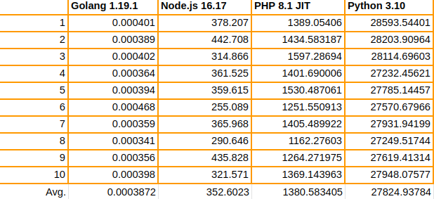
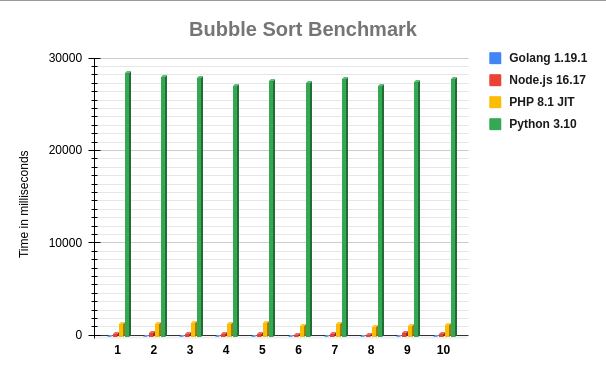

# PHP vs Node.js vs Python vs Golang Benchmark

***
In order to use this you need docker and run the docker-compose file and check the execution time of the script for each which is using a bubble sort algorithm on an array of 10000 random generated numbers.

To run this benchmark it's enough to execute `docker-compose up -d` and all three docker images will be build and a container will start for each of them.

***
I got the following times in seconds on a machine with 16Gb of RAM, Intel Core I7 CPU 5gen - 2.6Ghz and 250Gb SSD Hard Drive. Time is in milliseconds.

 